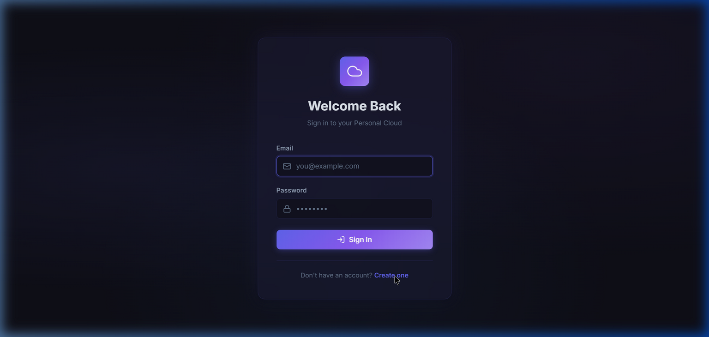
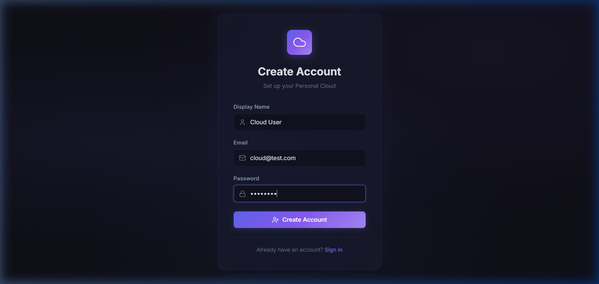
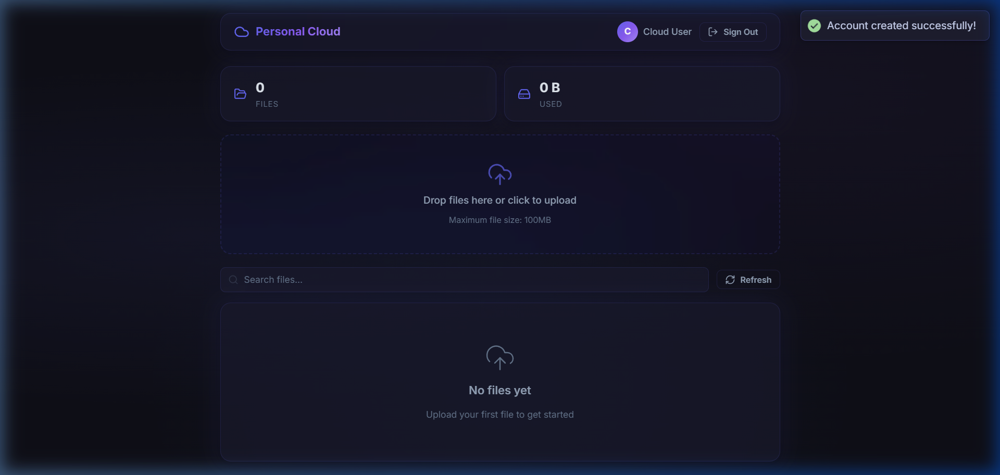

# Personal Cloud Server

## Project Overview
The Personal Cloud Server is a full-stack, responsive web application designed to turn any old PC or server into a private, accessible cloud storage solution. It provides secure user authentication, an intuitive modern interface, and robust file management capabilities.

## Key Features
- **Secure Authentication:** JWT-based stateless authentication with password hashing (BCrypt) and persistent Role-Based Admin controls.
- **Admin Provisioning & Quotas:** Public registration is disabled by default. Administrators can seamlessly provision users, set strict upload byte limits, and monitor usage across the platform.
- **Automated SMTP Workflows:** The system actively dispatches secure HTML welcome emails containing temporary passwords directly to the inbox of newly minted users. 
- **Global Data Analytics:** The frontend intuitively toggles storage statistics between "Personal Assigned Quotas" and "Actual Hardware Server Constraints" depending on your context.
- **File Management:** Upload, download, list, and delete files securely.
- **Folder Management:** Full support for creating, navigating, and managing physical & virtual folder hierarchies.
- **Drag & Drop Uploads:** Seamless intuitive file uploads with progress tracking.
- **Server Discovery (Symlinks):** Navigate and discover symlinked folders on the host machine to make existing external drives or folders accessible.
- **Search & Filtering:** Quickly locate files with real-time text search.
- **Premium UI:** Designed with a dark theme, glassmorphism, dynamic gradients, modern micro-animations, retro pixel art icons, and enhanced toast notifications (Sonner).

## Technology Stack
- **Frontend:** React 18, Vite, Axios, Lucide React (Icons), Vanilla CSS
- **Backend:** Java 17, Spring Boot 3.2, Spring Security
- **Database:** H2 (Development) / PostgreSQL (Production)
- **Deployment:** Docker, Docker Compose, Nginx

---

## Showcase

### 1. Login Screen
A beautiful, glassmorphic login interface to secure your instance.


### 2. Admin User Provisioning
Public registration is strictly restricted. Only authenticated system administrators can spawn new users, verify email formats, and transmit account credentials via an interactive user-management suite.


### 3. User Dashboard
The core interface where you can upload, manage, search, and preview your stored files.


---

## Deployment & Access

The project is fully encapsulated in Docker containers, making it trivial to deploy on Debian or any other Linux distribution:

1. **Clone the repository:**
   ```bash
   git clone <your-repo-url> /opt/personal-cloud-server
   cd /opt/personal-cloud-server
   ```

2. **Configure your `.env`:**
   Generate an App Password from your Google Account for the email delivery system.
   ```bash
   echo 'SPRING_MAIL_PASSWORD="your-app-password"' > .env
   ```

3. **Run with Docker Compose:**
   ```bash
   docker compose up -d --build
   ```

**(Optional) Access from Anywhere:** 
Connect a Cloudflare Tunnel to expose the local Docker instance securely to the internet via HTTPS, without needing to open any ports on the router.
```bash
cloudflared tunnel --url http://localhost:80
```
